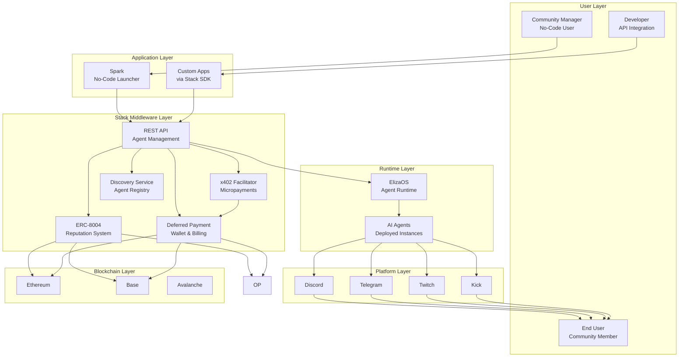
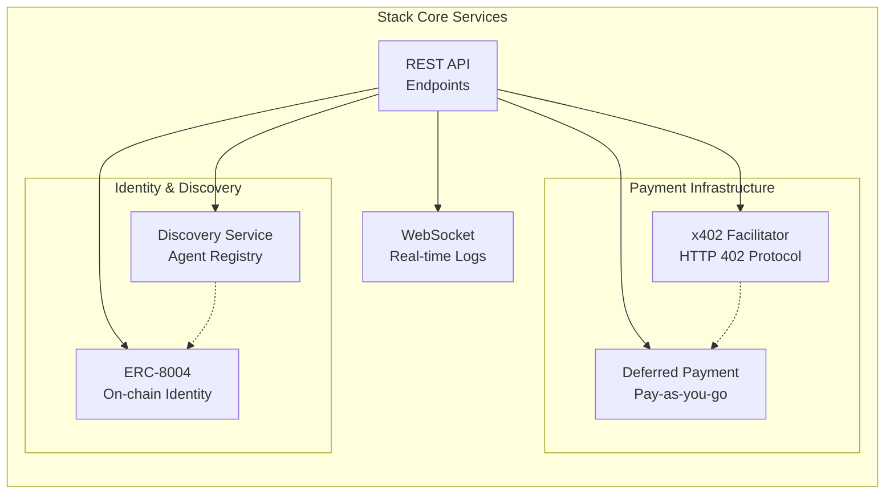
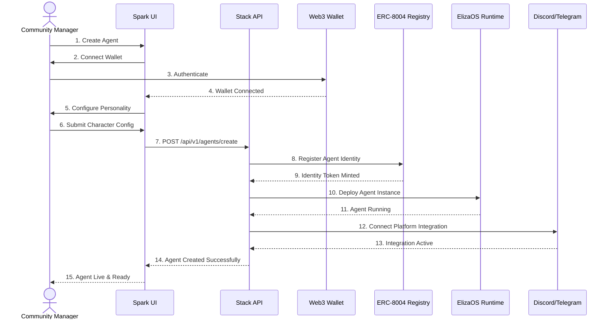
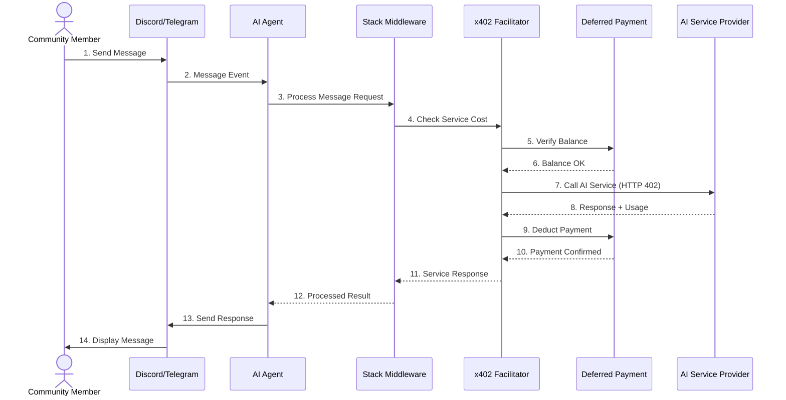
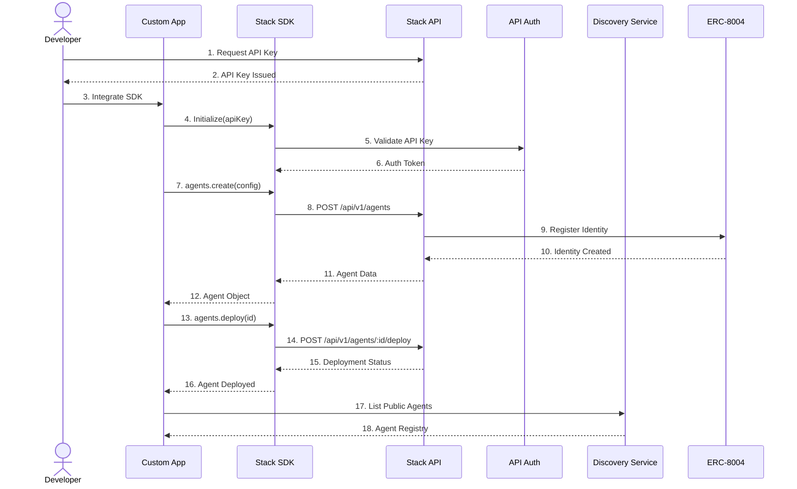
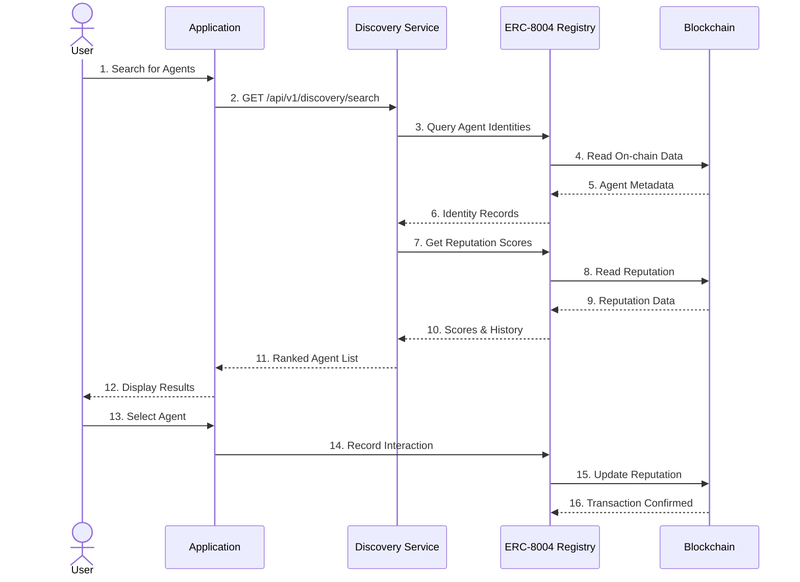

# PerkOS

> **The Operating System for AI Agents**

---

## Overview

**PerkOS** is a complete infrastructure platform for the agentic economy, providing everything needed to launch, manage, and monetize AI agents across multiple platforms. Built on Web3-native technologies, PerkOS combines no-code simplicity with production-ready infrastructure.

```
┌─────────────────────────────────────────────────────────────────┐
│                           PerkOS                                │
│       "The Operating System for Community AI Agents"            │
├────────────────────────────┬────────────────────────────────────┤
│           SPARK            │              STACK                 │
│      spark.perkos.xyz      │         stack.perkos.xyz           │
│  "Ignite your community"   │  "The infrastructure behind        │
│                            │         the spark"                 │
└────────────────────────────┴────────────────────────────────────┘
```

---

## System Architecture

### High-Level Architecture



### Stack Middleware Components



---

## Architecture

### **Spark** — Agent Launch Platform
[GitHub Repository →](https://github.com/PerkOS-xyz/Spark)

**Purpose**: No-code AI agent launcher for communities

**Key Features**:
- 🎨 **Visual Character Editor** — Design agent personality without code
- 🔌 **Multi-Platform Support** — Discord, Telegram, Twitch, Kick
- ⚡ **5-Minute Setup** — From idea to deployed agent in minutes
- 💰 **x402 Payments** — Native Web3 micropayments built-in
- 📊 **Real-Time Analytics** — Track engagement and usage metrics

**Target Users**: Community managers, Web3 founders, content creators

**Value Proposition**: Launch powerful AI agents for your community in minutes, not months.

---

### **Stack** — Agent Infrastructure Middleware
[GitHub Repository →](https://github.com/PerkOS-xyz/Stack)

**Purpose**: Production-ready infrastructure for agent-powered applications

**Core Services**:

1. **REST API**
   - Complete CRUD operations for communities, agents, and integrations
   - Agent lifecycle management
   - WebSocket support for real-time logs
   - Comprehensive documentation

2. **x402 Facilitator**
   - HTTP 402 protocol implementation
   - Micropayment processing
   - Usage-based billing
   - Service marketplace integration

3. **Discovery Services**
   - Public agent registry
   - Search and filtering
   - Agent metadata management
   - Cross-platform discovery

4. **Deferred Payment System**
   - Pay-as-you-go model
   - Wallet integration
   - Budget controls
   - Transaction history

5. **ERC-8004 Reputation System**
   - On-chain agent identity
   - Reputation scoring
   - Interoperable credentials
   - Trust verification

**Target Users**: Web3 developers, enterprise teams, blockchain startups

**Value Proposition**: Production-ready infrastructure so you can focus on building, not plumbing.

---

## Key Differentiators

### Spark vs. Traditional Bots

| Feature | Spark | Traditional Bots |
|---------|-------|------------------|
| AI-Powered | ✅ Full AI | ❌ Rules only |
| No-Code | ✅ | ⚠️ Varies |
| Custom Personality | ✅ | ❌ |
| Web3 Native | ✅ | ❌ |
| x402 Payments | ✅ | ❌ |
| Multi-Platform | ✅ | ⚠️ Limited |

### Stack vs. Building from Scratch

| Feature | Stack | Build from Scratch |
|---------|-------|-------------------|
| Agent-Specific | ✅ Purpose-built | ❌ Generic |
| x402 Payments | ✅ Native | ❌ DIY |
| ERC-8004 Identity | ✅ Native | ❌ DIY |
| Time to Production | Hours | Months |
| Web3 Native | ✅ | ⚠️ DIY |

---

## Quick Start

### Spark (Community Managers)

```bash
# 1. Visit spark.perkos.xyz
# 2. Connect your wallet
# 3. Create your agent's personality
# 4. Connect Discord/Telegram
# 5. Deploy — your agent is live!
```

**Time to deployment**: ~5 minutes
**Technical skills required**: None
**Pricing**: Pay-per-use via x402 (no subscriptions)

### Stack (Developers)

```bash
# Install SDK
npm install @perkos/stack-sdk

# Initialize
import { Stack } from '@perkos/stack-sdk';
const stack = new Stack({ apiKey: 'your-api-key' });

# Create agent
const agent = await stack.agents.create({
  name: 'My Agent',
  character: {
    bio: 'A helpful AI assistant',
    traits: ['helpful', 'friendly', 'knowledgeable']
  }
});

# Deploy
await stack.agents.deploy(agent.id);
```

**Documentation**: [stack.perkos.xyz/docs](https://stack.perkos.xyz/docs)
**API Reference**: [stack.perkos.xyz/api](https://stack.perkos.xyz/api)

---

## Sequence Diagrams

### Agent Creation Flow (via Spark)



### Message Processing with x402 Payment



### Developer Integration Flow (via Stack SDK)



### Agent Discovery and Reputation Flow



---

## Technology Stack

### Core Infrastructure
- **x402 Protocol** — HTTP 402 Payment Required implementation
- **ERC-8004** — On-chain agent identity standard
- **ElizaOS** — Agent runtime framework
- **Multi-chain** — Ethereum, Base, Avalanche support

### Integration Points
- **Messaging Platforms** — Discord, Telegram, Twitch, Kick
- **Payment Systems** — USDC, x402 micropayments
- **Identity** — Wallet authentication, on-chain reputation
- **Storage** — Distributed agent state management

---

## Use Cases

### For Communities (Spark)
- 🎮 **Gaming Guilds** — 24/7 automated community engagement
- 🎨 **NFT Projects** — Intelligent holder support and announcements
- 🏛️ **DAOs** — Governance assistance and member onboarding
- 📺 **Content Creators** — Stream chat interaction and moderation

### For Developers (Stack)
- 🤖 **Agent Marketplaces** — Discovery and reputation infrastructure
- 💼 **Enterprise Applications** — Custom agent deployments at scale
- 🔗 **Cross-Platform Tools** — Unified agent management APIs
- 💡 **AI-as-a-Service** — Monetize AI capabilities via x402

---

## Pricing

### Spark
**Pay-Per-Use Model** (x402 micropayments)

| Service | Price |
|---------|-------|
| Sentiment Analysis | $0.001/call |
| Content Moderation | $0.002/call |
| Image Generation | $0.02/image |
| Analytics Report | $0.10/report |

**No subscriptions. No hidden fees. Fund wallet, set budgets, stay in control.**

### Stack
**API Usage Tiers**

| Tier | API Calls/Month | Price |
|------|-----------------|-------|
| **Free** | 10,000 | $0 |
| **Pro** | 100,000 | $49/month |
| **Scale** | 1,000,000 | $299/month |
| **Enterprise** | Unlimited | Custom |

*x402 services billed separately at published rates*

---

## Repository Structure

```
PerkOS/
├── Spark/              # Agent launch platform (submodule)
├── Stack/              # Infrastructure middleware (submodule)
├── Docs/               # Marketing and documentation
│   └── PERKOS-MARKETING-GUIDE.md
└── README.md           # This file
```

---

## Getting Involved

### For Community Managers
- **Launch Your First Agent**: [spark.perkos.xyz](https://spark.perkos.xyz)
- **Join Discord**: Get support and share experiences
- **Read Tutorials**: Learn best practices for agent personalities

### For Developers
- **Get API Access**: [stack.perkos.xyz](https://stack.perkos.xyz)
- **Read Documentation**: Comprehensive guides and API reference
- **Explore Examples**: Fork starter projects and templates
- **Join Discord**: Technical support and developer community

---

## Roadmap

### December 2025 (Week 1) - Project Inception ✅
- ✅ Repository initialized (December 1, 2024)
- ✅ Core architecture defined
- ✅ Marketing strategy developed
- ✅ Brand identity established

### Q1 2026 - Foundation
- 🔄 Spark MVP development (no-code launcher)
- 🔄 Stack API development (core endpoints)
- 🔄 x402 payment integration
- 🔄 Discord + Telegram support
- 🔲 ElizaOS integration
- 🔲 ERC-8004 identity system

### Q2 2026 - Expansion
- 🔲 Twitch + Kick integration
- 🔲 Enhanced analytics dashboard
- 🔲 Agent marketplace launch
- 🔲 Advanced AI services
- 🔲 Community beta program

### Q3 2026 - Scale
- 🔲 Enterprise features & SLAs
- 🔲 Mobile app (iOS/Android)
- 🔲 Cross-chain expansion
- 🔲 Developer grants program
- 🔲 Agent discovery v2

### Q4 2026 - Innovation
- 🔲 Advanced reputation system
- 🔲 Agent-to-agent communication
- 🔲 Multi-modal AI capabilities
- 🔲 Enterprise white-label solutions

---

## Documentation

- **Marketing Guide**: [Docs/PERKOS-MARKETING-GUIDE.md](Docs/PERKOS-MARKETING-GUIDE.md)
- **Spark Documentation**: [spark.perkos.xyz/docs](https://spark.perkos.xyz/docs)
- **Stack Documentation**: [stack.perkos.xyz/docs](https://stack.perkos.xyz/docs)
- **API Reference**: [stack.perkos.xyz/api](https://stack.perkos.xyz/api)

---

## Community & Support

- **Website**: [perkos.xyz](https://perkos.xyz)
- **Discord**: Join our community for support
- **Twitter/X**: [@PerkOS_xyz](https://twitter.com/PerkOS_xyz)
- **Email**: support@perkos.xyz

---

## License

[License information to be added]

---

<p align="center">
  <strong>PerkOS</strong><br>
  <em>The Operating System for AI Agents</em><br><br>
  "Spark ignites. Stack powers."
</p>
